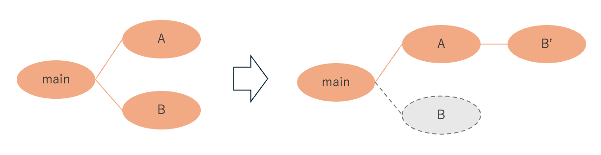

# 第9回振り返りレポート
今回レポートを書くにあたり、GitHub Docsのページを参考にした[^1]。

## 1. GitHubアカウントとURL
アカウント名: chamiyasu

Account URL: https://github.com/chamiyasu

## 2. グループのOrganizationのURL
Organization URL: https://github.com/2024AIT-OOP2-G17

## 3. 作成した日記リポジトリのコミットログ
日記リポジトリのURL: https://github.com/2024AIT-OOP2-G17/Diary

<pre>
*   commit 28efbbfd538e89b444aa9bd1be7d3490be103ec6 (HEAD -> main, origin/main, origin/HEAD)
|\  Merge: 3d918de eb407b6
| | Author: k23093kk <k23093kk@aitech.ac.jp>
| | Date:   Tue Dec 3 21:19:08 2024 +0900
| | 
| |     Merge pull request #6 from 2024AIT-OOP2-G17/finalDiary
| |     
| |     update
| | 
| * commit eb407b6bdfcc82a0a5084d96bf74b761578475d0 (origin/finalDiary)
|/  Author: Nonaka Hayato <k23093kk@YuhiMacBook-Air.local>
|   Date:   Mon Dec 2 23:50:47 2024 +0900
|   
|       update
|   
*   commit 3d918de33ecd6881de4188f1637e893efe83483a
|\  Merge: 31624a7 04cb302
| | Author: kakeru-sakai <k23053kk@aitech.ac.jp>
| | Date:   Thu Nov 28 16:03:02 2024 +0900
| | 
| |     Merge pull request #4 from 2024AIT-OOP2-G17/Sakai-diary
| |     
| |     add SakaiDiary
| |   
| *   commit 04cb302fec03eac6721a4e4e0ef6578cbbb25aa9
| |\  Merge: 7dcf105 31624a7
| |/  Author: kakeru-sakai <k23053kk@aitech.ac.jp>
|/|   Date:   Thu Nov 28 16:02:46 2024 +0900
| |   
| |       Merge branch 'main' into Sakai-diary
| |   
* |   commit 31624a792a49af4a5185e539ec66b5f60811664e (origin/k23093_Diary, k23093_Diary)
|\ \  Merge: 8be35ce 9a56e0e
| | | Author: yabukou <136439912+yabukou@users.noreply.github.com>
| | | Date:   Thu Nov 28 16:01:34 2024 +0900
| | | 
| | |     Merge pull request #5 from 2024AIT-OOP2-G17/Yabhushita＿Update
| | |     
| | |     Samplel消した
| | | 
| * | commit 9a56e0eacf56ef952252e14e6df5085576d4d28d
|/ /  Author: yabukou <136439912+yabukou@users.noreply.github.com>
| |   Date:   Thu Nov 28 16:01:16 2024 +0900
| |   
| |       Samplel消した
| |       
| |       Sampleを消しました
| |   
| *   commit 7dcf1055814aa657cb0858ed98e86f4379f04858
| |\  Merge: f8799d8 8be35ce
| |/  Author: kakeru-sakai <k23053kk@aitech.ac.jp>
|/|   Date:   Thu Nov 28 16:01:29 2024 +0900
| |   
| |       Merge branch 'main' into Sakai-diary
| |   
* |   commit 8be35ce926a4b7b2c0fba3ee5aa7abacdc225f00
|\ \  Merge: 8a64a1c 4170365
| | | Author: K23115_maiko <k23115kk@aitech.ac.jp>
| | | Date:   Thu Nov 28 15:58:06 2024 +0900
| | | 
| | |     Merge pull request #3 from 2024AIT-OOP2-G17/fuwa-diary2
| | |     
| | |     Update main
| | | 
| * | commit 4170365215586ac121816074bc98d862f1be6e1b
|/ /  Author: maiko <hm72fuwa@gmail.com>
| |   Date:   Thu Nov 28 15:57:22 2024 +0900
| |   
| |       Update main
| | 
* | commit 8a64a1c0224868e9e372c0ac51cc6772ebbd9c23
| | Author: maiko <hm72fuwa@gmail.com>
| | Date:   Thu Nov 28 15:53:26 2024 +0900
| | 
| |     fuwa update
| |   
* |   commit d39dcc62c506a1cc318fb72ede5fff5b9ddb7cd3
|\ \  Merge: 3d7bec3 7786a59
| | | Author: K23115_maiko <k23115kk@aitech.ac.jp>
| | | Date:   Thu Nov 28 15:50:22 2024 +0900
| | | 
| | |     Merge pull request #2 from 2024AIT-OOP2-G17/fuwa-diary
| | |     
| | |     不破更新
| | |   
| * |   commit 7786a5960e1b92d31a3506c28ae0a317db7e20f5
| |\ \  Merge: 4a8dd3b 3d7bec3
| |/ /  Author: K23115_maiko <k23115kk@aitech.ac.jp>
|/| |   Date:   Thu Nov 28 15:49:45 2024 +0900
| | |   
| | |       Merge branch 'main' into fuwa-diary
| | |   
* | |   commit 3d7bec385a49517c0c8411c25f730a28cb1491c0
|\ \ \  Merge: c5f8222 a277028
| | | | Author: denkidhi <134796078+denkidhi@users.noreply.github.com>
| | | | Date:   Thu Nov 28 15:46:06 2024 +0900
| | | | 
| | | |     Merge pull request #1 from 2024AIT-OOP2-G17/miyake_diary
| | | |     
| | | |     日記の追加
| | | | 
| * | | commit a277028715c0c978ff991ab693237b8f13c586b2
|/ / /  Author: denkidhi <0re.re0.000@gmail.com>
| | |   Date:   Thu Nov 28 15:40:31 2024 +0900
| | |   
| | |       日記の追加
| | |       
| | |       自分の日記を追加
| | | 
| * | commit 4a8dd3ba59a2b383c2f2bfd1fcbb36dbb61875cb
|/ /  Author: maiko <hm72fuwa@gmail.com>
| |   Date:   Thu Nov 28 15:45:48 2024 +0900
| |   
| |       不破更新
| | 
| * commit f8799d87a281738407ce1f96c4a28bf40d37464f
|/  Author: kakeru-sakai <k23053kk@aitech.ac.jp>
|   Date:   Thu Nov 28 15:44:40 2024 +0900
|   
|       Update: add SakaiDiary
| 
* commit c5f8222b99725b3e97ac2de7b7d335ea300a1b37
| Author: yabukou <136439912+yabukou@users.noreply.github.com>
| Date:   Thu Nov 28 14:52:35 2024 +0900
| 
|     日記作成
| 
* commit 0c52f4702a11d052a8b55051720837f2e5df6642
  Author: yabukou <136439912+yabukou@users.noreply.github.com>
  Date:   Thu Nov 28 14:49:40 2024 +0900
  
      Initial commit
</pre>

## ４. Git, GitHubに関する調査
### 4-1. Gitを始めとしたバージョン管理システムを利用することによるメリットはなにか
　新たな機能を実際する際に、正常に動く状態を残したまま開発を行うことができる。これは、複数人でプロジェクトを行っている際に、実装確認がいつ何時でも行えると言うメリットがある。

　加えて、すでに他社が見れる状態にある公開済み・配信済みのものであれば、その機能を停止させることなく開発を進められると言うメリットもある。

　また、一部機能の仕様を複数パターンで検討している際の比較にも用いることができる。

### 4-2. Gitにおけるキーワード「clone」「commit」「push」「branch」「fetch」「pull」「merge」「rebase」についてそれぞれ何をするものか (他者に説明できるよう、わかりやすく簡潔な文章で表すこと)
以下、Gitのドキュメントを参考にした[^2]。

#### 「clone」
リモート(ネットワーク上)のリポジトリを、自分のローカルなディレクトリに複製する。(参照ではない)

#### 「commit」
リポジトリの変更を記録する。pushの前段階として、正しい変更か確認する場でもある。

#### 「push」
加えた変更を、リモートのリポジトリに対し共有し、更新を行う。

ただし、子ブランチからのpushであれば、共有のみで止まる。

#### 「branch」
親であるmainから枝分かれするように子ブランチを作ることで、変更履歴を個別で保存できる。
変更を加える際の、時間軸を分けるイメージ。

#### 「fetch」
リモートリポジトリの変更・最新状態を取得する。

#### 「pull」
リモートリポジトリの変更・最新状態を、ローカルリポジトリに実際に取り込む。

#### 「merge」
異なるブランチ間で加えた変更を、リモートのリポジトリに対し実際に適応させ、mainブランチに合流させる。

#### 「rebase」

異なるブランチにて同時に変更を加え際に、片方のブランチ内に変更をまとめて、統合する。
具体的には、A、Bのブランチで書き換えた際は、Aのブランチでの書き換えを保存し、Bでの書き換え内容をAブランチに持ってきて、Aブランチ内で統合する。

### 4-3. プロジェクト進行に、Pull Requestを用いたGitHub Flowを採用することで、解決できるチーム開発での問題はなにか (実際にGitHub Flowで作業する手順も説明できる範囲でする)
　1つのプロジェクト内で役割分担をした際に、コードの変更箇所の照らし合わせが容易になり、  同時に変更を加えてしまった故の、予期せぬエラーなどを防ぐことができる。具体的には、作業の流れを踏まえながら以下に説明する。

　まず個人が異なるブランチをし、作業内容をcommit、Pull Requestする。
GitHub内で、個々の変更箇所を確認でき、もし同じ箇所に変更を加えてしまった際は競合(コンフリクト)を知らせてくらるため、意図しない不適切な統合を回避し、  **エラーが発生する**、**エラーの要因がわからない**という問題を防ぐことができる。

　その後、そのページ上にて重複していれば消す、どちらも必要であれば、二つとも残すようにコードを書き換えることで、競合をスムーズに治すことができる。最後に異なるブランチ上にある変更をマージして、一つのブランチに合流させることで、無事統合が完了する。

　これは、コードを1人のもとに集めることなどもせずとも統合できる上、全ての人でコードの確認を行えるので、**統合の主軸となるメンバーの負担が重くなる**という問題も解消される。

### 参考文献
[^1]: "基本的な書き方とフォーマットの構文", GitHub Docs,  
https://docs.github.com/ja/get-started/writing-on-github/getting-started-with-writing-and-formatting-on-github/basic-writing-and-formatting-syntax  
(参照：2024-12-05)

[^2]: "Git-Reference", Git,  
https://git-scm.com/docs  
(参照：2024-12-05)

