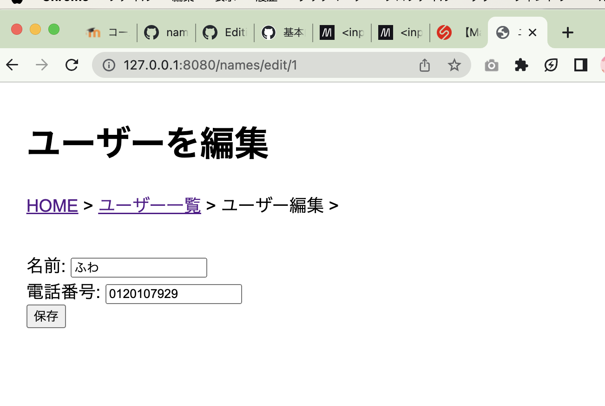

# 第10回課題

## 1. データ登録アプリケーションにて登録するデータ
<!-- 自分の担当分だけでなく、グループ全体のデータを書いてください。
メンバー全員が同じ内容になるはずです。 -->
- ユーザー(名前と電話番号)
- 生まれ(生年月日、星座)

## 2. 自分が担当したデータや画面（文章での説明）
<!-- データの形式やデータ型、登録画面での詳細に書いてください。 -->
担当したデータは、ユーザー(名前と電話番号)であり、その中の編集画面(name_edit.html)を担当した。
名前はtext型、電話番号はnumber型での入力にし、登録時と方式をそろえた。
また、受け取った情報は、どちらも文字列で管理した。

電話番号に関しては,次回講義にて扱う際に、市外局番などの部分ごとに分ける入力をしていない分、
文字列の方が扱いやすいかと思い、提案した。
(先頭数字によっての場合わけが、桁数が異なっても行いやすい。)

また、ユーザーに該当するPythonファイル(name.py)も担当した。

以下、自分が実際に行ったPullRequestである。
1. https://github.com/2024AIT-OOP2-G17/personal-information/pull/1
   - 各自(ユーザーを担当する)が書き換えるファイル(名前だけ変更)を作成。

3. https://github.com/2024AIT-OOP2-G17/personal-information/pull/6
   - name_edit.htmlの中身の作成。

4. https://github.com/2024AIT-OOP2-G17/personal-information/pull/9
   - modukes/name.pyの中身の作成
   - rotes/name.pyの中身の作成

5. https://github.com/2024AIT-OOP2-G17/personal-information/pull/14
   - name_edit.htmlの修正

6. https://github.com/2024AIT-OOP2-G17/personal-information/pull/17
   - 共通ファイル(__init__.py, index.html)の変更
   - 他エラー箇所の修正  
  (ここは、エラーの原因を判明するべく、全員で協力した場所のため、担当ページ外も触れています。)

7. https://github.com/2024AIT-OOP2-G17/personal-information/pull/18
   - 電話番号の入力フォームをnumner型に修正

## 3. 自分が作成した画面のスクリーンショット
<!-- 画像のリンクは文章中にMarkdown形式で  として書き、提出は画像ファイルを別途添付してください -->

## ４. 感想
<!-- 次に活かせる反省等をここに書いておきましょう -->
今回、自分の反省点としては、プルリクの箇所をちゃんと確認せず送ってしまったことである。
もう少し注意深く取り組めるように気をつけたい。
また、一番良くなかったなと感じたのが、自分が犯したミスを班員全員にしっかりと共有しなかったことだ。
私が共有を行えていらば、送り先のミスが多発は防げたのではと感じる。

グループでの制作で、現状困っていることとしては、やることがわからない・ない子がいる状態で時間が過ぎてしまっている点だ。
こちらも声掛けをして確認しなくてはいけないのは反省である。
しかしながら、一声かけてくれればよりスムーズにやり取りできるのにというもどかしさもある。

これらの事項は、次回に活かしたい。

