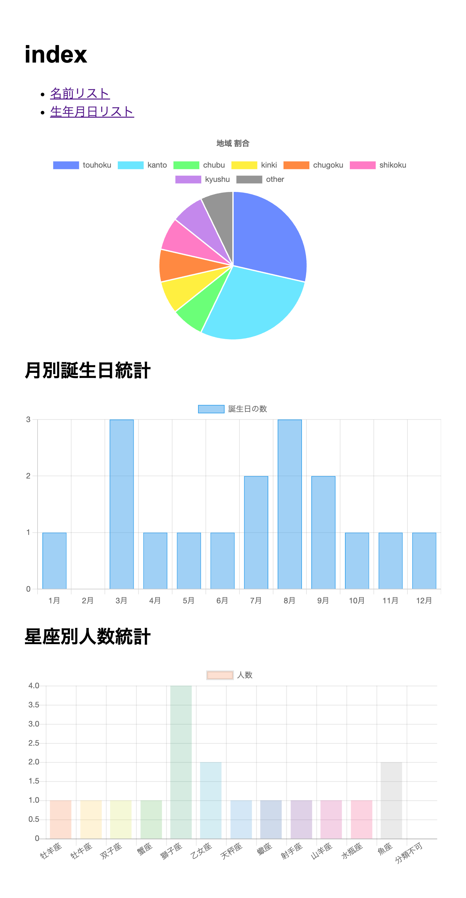

# 第10回課題

## 1. データ登録アプリケーションにて登録するデータと集計しトップページに載せる情報の詳細
<!-- 
・自分の担当分だけでなく、グループ全体のデータを書いてください。
・メンバー全員が同じ内容になるはずです。
 -->
### 登録するデータ
- ユーザー
   - 名前
   - 電話番号
- 誕生日等
   - 生年月日
   - 星座

### 集計・表示する情報の詳細

- 電話番号の集計
   - 固定電話番号であるという前提で、市外局番から住んでいる県を判別し、「7地域 + 例外」の8つに分類して、それぞれの人数を集計
   - 集計した8つの項目で円グラフの表示
- 誕生月の集計
   - データが年月日の8文字であると仮定し、月のデータにあたる左から５・6文字目を取得し、当てはまる月に人数を加算する
   - 集計した月毎の人数を棒グラフで表示
- 星座の集計
   - 入力した文字列が12星座いずれかの漢字またはひらがなと完全一致しているかで判断する
   - 一致しない場合は分類不可とし、12星座と合わせて13項目に分類
   - 集計した13項目を棒グラフで表示

## 2. 自分が担当した部分の説明（文章での説明）
<!-- 
・データの形式やデータ型、集計条件や出力方法、使用したライブラリなど詳細に書いてください。
・自分が作成したPullRequestのURLも説明とともに記載してください。
 -->
担当したのは、電話番号の集計であり、その中でも特に、データの管理・転送とグラフの表示を担当した。
電話番号はnuber型で入力し、int型で扱うようにした。
前回の提出文では、textフォームで入力にしていたが、マージしたのち動かしてみたところ、
正常にデータを扱えなかったため、numberにした。  
PullRequest 1：https://github.com/2024AIT-OOP2-G17/personal-information/pull/18  

このプロジェクトにかけるコストを考えた上で、入力値の制限をかけるのは厳しかったので、「固定電話の登録」という前提条件を設けた上での実装を行なった。

集計条件としては、固定電話の市外局番に着目し、県をを判別し、「北海道+東北、関東、中部、近畿、中国、四国、九州+沖縄」の7地域と、「その他」の8つに分け、それぞれの数を集計することとした。
具体的な集計法としては、各地域の数を要素(int型)とするクラスPrefectureを作成し、起動時に一度だけ変数を作成するようにした。
以降、その変数に対し、該当する地域の要素を増減することで、集計を可能にしている。  
地域の判別は電話番号の上位3桁ほどを見て、[総務省による市外局番の一覧](https://www.soumu.go.jp/main_content/000141817.pdf)を参考に分けた。また、これを関数化し増減数を引数として受け取るようにすることで、データに編集をかけた際の数の変化を容易に可能にした。  
データの受け渡しにはテンプレートエンジンであるjinja2を用いた。indexを開く際に集計した情報をrenderを用いて引数とした渡し、HTMLに直接埋め込む形で実現した。
ここで、開発環境がVSCodeであり、HTML内のJavaScript文に設定なしに埋め込みの記述が行えなかった。そこで、VSCode側にHTMLはjinja2を用いていることを伝える設定を付け加えた。  
出力方法は、JavaScriptのライブラリであるChart.jsを用いて、他データの集計の表示と被らないよう、また見応えがある表示法がいいという思いを元に円グラフにした。  
PullRequest 2：https://github.com/2024AIT-OOP2-G17/personal-information/pull/24

## 3. レビューを行ったグループメンバーのPullRequestのURL
<!-- 
・簡単なコメントを添えてください。
・リーダーもここは書いてください。
 -->
レビューしたPullRequest：https://github.com/2024AIT-OOP2-G17/personal-information/pull/28  
今回のグループでワークでは、私がデータの転送部分を作り、それに合わせてコードを書いてもらったので、意図した作りでコーディングされるかを主に見た。
あらかじめ、どのような形でデータを管理し、判別するかなどを話し合っていたため、基本問題ないコードであると考えた。  
変数にエリア名を入れ、match文を抜けた後に一度だけPrefecture.get_or_none()を行っているところが、仮で書いたコードよりも綺麗にまおめられていて良いと感じた。  
ただ、自分の狙いが伝わっていない箇所もあったので、別途コメントを残しておいた。

## 4. ある程度のデータ登録がされた状態での画面のスクリーンショット
<!-- 画像のリンクは文章中にMarkdown形式で  として書き、提出は画像ファイルを別途添付してくださ
い -->

## 5. 感想
<!-- 次に活かせる反省等をここに書いておきましょう -->
前回の反省を生かし、積極的に声をかけたら、会話が増え、イメージ共有や連携がうまくいった。  
今回のグループでワークではデータの転送に困っており、なかなか作業が進まなかったが、リーダーの声かけが積極的で、雰囲気良くやれた。具体的には、今現状の状況を聞き困っていることなどを共有したり、コードを書くことはできないので、代わりにHTMLへのグラフの表示方法を調べてくれたり、困っている人の元へ一番い駆けつけていたと思う。  
ただ、授業街での作業の進みがあまりいいとは言えないので、もう少し余裕を持ったやれたらなと感じる。
また、それを改善するために、自分の作業は終わったからという態度ではなく、それを報告し、残りはこれがあるからやって欲しいだったり、一緒に考えようだったり働きかけるべだと考えた。  
加えて、teamsでやり取りを行っているが、授業外での反応が一回もない子が1人いるので、気がかりではある。

