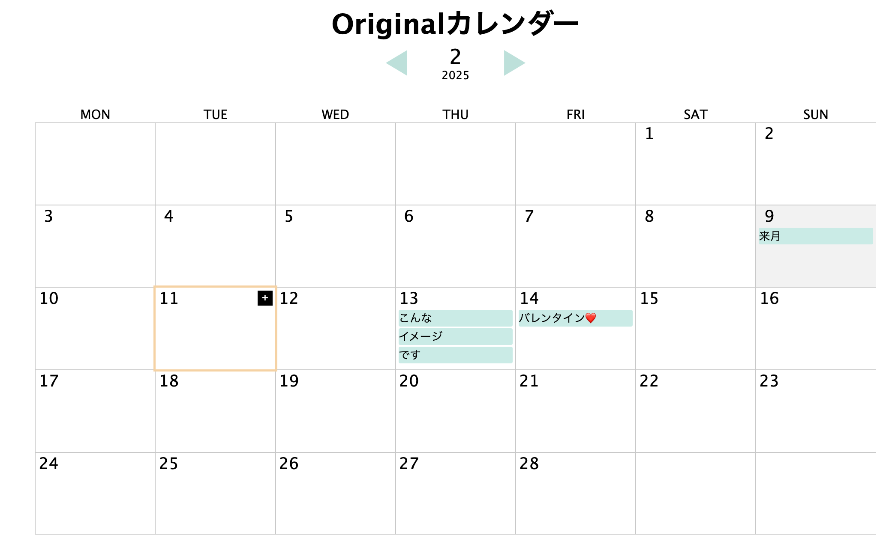
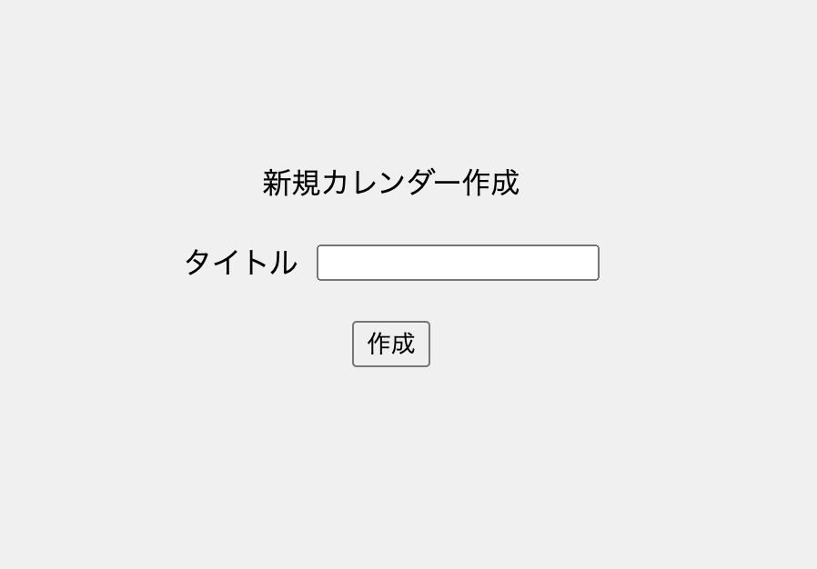
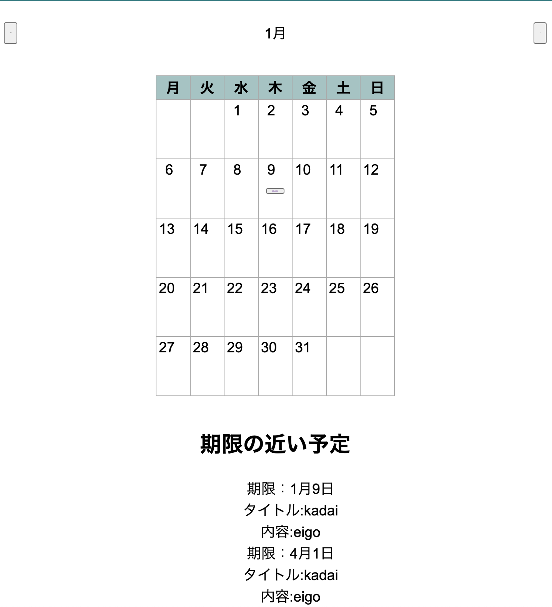

# オブジェクト指向プログラミングおよび演習 第12回進捗レポート

## 作成者情報

- 学籍番号：K23115
- 氏名：不破麻郁子
- グループ：17
  - メンバー
    - K23132 薮下晃大（チームリーダー）
    - K23027 小沢航希 　1/9(金) 休み(事前連絡有り)
    - K23053 酒井翔琉
    - K23093 野中勇飛
    - K23115 不破麻郁子
    - K23121 三宅玲央

## 仕様

<!--
- flaskを使ったフォトアルバム
- 画像をアップロードできる
- アップロードした画像にタグをつけられる
- アップロードした画像にコメントを書ける
- 画像検索ページでタグやコメントから画像を検索できる
- CSSで画面を見やすくする
-->

- [x] カレンダーの表示(一月で一ページ)
- [x] カレンダーに用事登録
- [ ] 種類ごとにカレンダー（課題、バイト、趣味）
- [ ] カウントダウン
- [ ] 達成日
- [ ] 繰り返し登録（例：毎週月曜日に課題）
- [x] CSSで画面を見やすくする

## アプリ完成イメージ
<!-- 
- ここにトップページの手書きいらすと（top_page.jpegもMoodleへアップロードした）
- ここに画像リストページの手書きイラスト(image_list_page.jpeg)
- ここに画像アップロードページの手書きいらすと(upload_page.jpeg)
- ここに画像検索ページの手書きイラスト(search_page.jpeg) 
-->

- トップページ

- カレンダーの追加画面

- 直近の予定(画像下方)

## 作業分担
<!--
- 画像をアップロードできる（担当：K23997 工業自由）
- アップロードした画像にタグをつけられる（主担当：K23999 愛知太郎，副担当：K23998 愛知花子）
- アップロードした画像にコメントを書ける（主担当：K23998 愛知花子，副担当：K23999 愛知太郎）
- 画像検索ページでタグやコメントから画像を検索できる（担当：K23996 工業正義）
- CSSで画面を見やすくする（担当：K23995 工業愛） 
-->

- カレンダーのデザインと表示(担当:K23115不破麻郁子)
- 用事を登録する(担当:K23053 酒井翔琉)
- 登録したものをカレンダーに表示する、予定の編集(担当:K23093 野中勇飛)
- 登録画面のデザイン(担当:K23027小沢航希)
- カレンダーを増やす機能(担当:K23132 籔下晃大)
- 期限の近いものをカレンダーの下に表示(担当:K23121 三宅玲央)

## 作業報告
<!-- 
- 画像を保管する仕様を愛知花子と話あって決めた
- 保管した画像がWebページに表示されるところまで愛知花子と共同作業して作った
  - プルリクエストへのリンク
  - 上のプルリクエストがマージされた
   -->

### プルリクエスト
1. 予定表示の年参照：https://github.com/2024AIT-OOP2-G17/calendar/pull/24

### 予定の表示更新
- 登録データに年が追加された
  - ホバー時時にボタンが表示されるようにした

## グループ内でお世話になった人2〜3名を理由とともに挙げる
<!-- 
- 画像処理のベースプログラム実装を一緒にした(K23998 愛知花子)
- プルリクエストを処理してくれた（K23999 愛知太郎）
- 調べ物を手伝ってくれた(K23995 工業愛)
-->

K23132 薮下晃大（チームリーダー）
- 制作物の方針、役割分担、これからの日程など全ての決め事などにおいて、チームを仕切ってくれた。
- みんなのまとめ役として意見を引き出したり取り入れたり、最終的な取り決めを行ってくれたので、スムーズに話が進んだことに加え、雰囲気良く話がまとまった。

K23053 酒井翔琉
- 会議の際に、未実装であっても、どんな内容で進める予定などをしっかりと共有していたので、以降の制作を滞りなく進められた。
- また、積極的に活動に参加しており、制作も進んでいるので、良い刺激になっている。

K23121 三宅玲央
- 会議内での発言量が最も多く、意見を出したり、雰囲気を作ってくれ、みんなが話しやすくなった。

## 振り返り（感想含む）と次回までの作業予定
<!-- 
- 計画通りに作業は進んでいる
- 画像を取り扱う共通仕様は愛知花子と共同で作成したが，来週からは作業を分担してすすめる
-->

自分の反省としては、途中、役割分担を決めたにも関わらず、勢いでメンバーの担当箇所も進めてしまっていたので、他メンバーの担当もしっかりと把握しながら、自分がやるべきことを明確にし、的確に進めていきたい.  
しかしながら、休みの期間を有効活用でき、自分の担当であるカレンダーの表示、デザインをおおかた作ることができた。ここからは、他メンバーの機能に合わせデザインを変えたりする方向になっていくので、余裕があればサポート的な役回りもできたら良いなと考える。

### 次回までの作業予定
 - カレンダーの空白部分を埋める
   - 先月末と来月初めの日付を取得し、表示する
   - わかりやすいよう、見た目の工夫も

### その他
- K23027 小沢航希　について
休み前最終講義にて、会議の日程をきめ、全員了承済み。
しかしながら、事前・事後の連絡なしに参加なし。
1/9(木) 休む連絡の方はあり。
(毎授業の際に使えること自体は確認できている。)

他班員はきちんと連絡も取れ、進捗の共有なども行えているので、
お世話になっている人には人数的に書けませんが、配慮していただけたらと思います。

